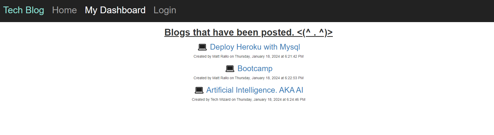
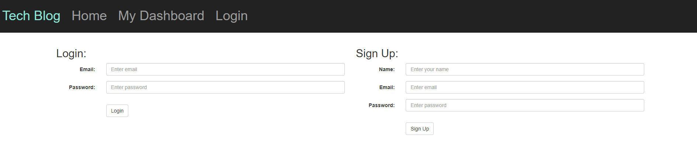
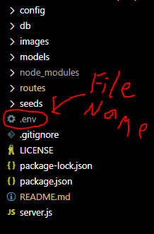
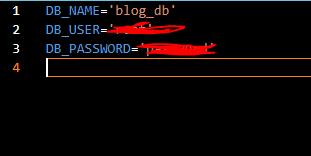

# Tech Blog

A blog site where users can post articles, opinions, thoughts, and comments on tech related stuff. I use the MVC paradigm for its structure. This app was made from scratch and utilizes Express, Sequelize, Bcrypt, and MYSQL2 packages. Bcyrpt allows you to hash passwords, which I use to keep user passwords safe. A user can create an accout, sign into an account, post / delete / edits blogs, as well as comment on other users' blogs. Each blog and comment have a date / time that they were posted. 

### Check out the live site now while it's available! 

https://cryptic-reef-70222-75cf3c6deb65.herokuapp.com/

# Installation

If you are running the code locally, you will need to have node js installed. I used the recommended version which is 20.10.0 LTS as of now. Also have mysql installed. You will also need to create a dotenv file that contains the user and password information (see screenshots below). Log into mysql and run the schema file located in the db directory. After all that, in the terminal type "npm install" and hit enter. This should install all the npm packages used. I also have a seeds folder that have dummy data to work with. Just type node seeds/seed.js to run the code. After type "npm start" and this should now be running on the localhost. Don't forget to terminate process once you are done. Use ctrl c to exit. 

Link to node js: https://nodejs.org/en/ Link to mysql: https://www.mysql.com/

## Screenshots

### Setting up dot env file

File should be named ".env"

These are the contents of the file. DB_USER can be found by running this sql statement in mysql "SELECT user FROM mysql.user;" 
The username in my case was on the bottom of the list returned. THE DB_PASSWORD is the password you used for mysql when setting it up.
The DB_NAME is the database being used. I called it "blog_db" when the database is created from the schema file. 

## License

